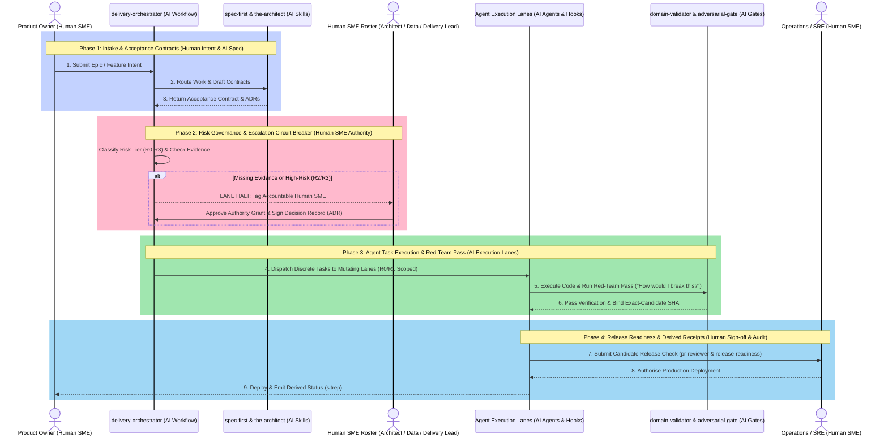

# AI-Native Developer Experience Harness

[](https://www.claudepluginhub.com/plugins/jpantsjoha-join-the-team?ref=badge)
[](https://agent-plugins.org/specification)
[](https://agentskills.io/specification)

> **A team-project AI harness bootstrap that gives humans and agents a shared operating contract from day one, moving AI leverage from an individual “IC superhero” advantage to a repeatable team capability on an equal playing field.**

> 📦 **Now listed on [Claude Plugin Hub](https://www.claudepluginhub.com/plugins/jpantsjoha-join-the-team)** —
> install the harness as the `join-the-team` plugin for Claude Code, Codex, Kimi Code,
> and Google Antigravity. [Jump to install](#install--two-ways-to-adopt).

This repository has gone through three real phases — and the progression tracks something
happening across the field.

It started as a **reference guide**: [`DEVELOPER_EXPERIENCE.md`](DEVELOPER_EXPERIENCE.md)
and [`BOOTSTRAP.md`](BOOTSTRAP.md), something to read, walk through, and adapt. A concrete
baseline for teams getting serious about AI-native delivery — the operating model, the
guardrails, spec-first discipline, the Adversarial Gate.

Then it became **context for your agents**: `CLAUDE.md` and `GEMINI.md` here, plus the
thin `AGENTS.md`/`CLAUDE.md`/`GEMINI.md` adapters the bootstrap generates — drop them
into a project and the agent picks up the operating contract at session start without a
briefing. The harness shifted from something humans read to something agents use.

Now it ships as an **installable plugin** — `join-the-team` (current version in
[CHANGELOG.md](CHANGELOG.md)). One install across
Claude Code, Codex, Kimi, and Antigravity, and the full harness is live: 21 skills,
session-start orientation, slash commands, drift-checked in CI. The discipline travels
with the agent from day one, across every project, without anyone copying files or
re-explaining the contract.

The point: this stopped being something you read and became something you install.

And what you install is the **operating model** — that is the value proposition here.
Skill libraries are everywhere now; what teams are missing is the contract: who holds
authority, how risk is tiered, what evidence binds a review, what "done" actually means
when humans and agents ship together. The 21 skills are the capability layer that
executes inside that contract — not the other way round.

The kernel stays model-, vendor-, and IDE-agnostic throughout. Thin platform adapters
handle discovery and invocation; the authority, risk, evidence, review, and completion
semantics are non-negotiable.

> **Speed is easy. Safe speed is engineered.**

> **This is deliberately opinionated.** Refine it for your team, technology, domain,
> authority model, and definition of done. Keep one coherent shared contract while doing so.

**New project?** [Bootstrap in fifteen minutes](BOOTSTRAP.md). **Existing agent setup?**
[Two ways to adopt](#install--two-ways-to-adopt) below — by hand, or as a plugin.

## Install — two ways to adopt

**By hand** — clone the repo and share it with your agents. Copy `skills/` into
your project, keep the `CLAUDE.md`/`GEMINI.md`/`AGENTS.md` adapters at root, and your
assistant picks up the contract at session start. [BOOTSTRAP.md](BOOTSTRAP.md) is the
fifteen-minute walkthrough.

```bash
git clone https://github.com/jpantsjoha/ai-native-developer-experience
```

**As a plugin** — the harness ships as `join-the-team`: one canonical skill
set, thin per-harness adapters, drift-checked in CI. It is listed on
[Claude Plugin Hub](https://www.claudepluginhub.com/plugins/jpantsjoha-join-the-team);
install straight from this repository into whichever coding assistant you run:

**Claude Code**

```text
/plugin marketplace add jpantsjoha/ai-native-developer-experience
/plugin install join-the-team@join-the-team-marketplace
```

**Kimi Code**

```text
/plugins install https://github.com/jpantsjoha/ai-native-developer-experience
```

**Antigravity (Gemini)**

```bash
agy plugin install https://github.com/jpantsjoha/ai-native-developer-experience
```

**Codex** — no install command needed: Codex reads `AGENTS.md` as its always-on adapter and
discovers skills from `.agents/skills/`. The by-hand clone above is the install; if you are
vendoring rather than cloning, put the directory at `.agents/skills/` (or symlink it there)
so Codex finds it.

Full per-harness detail (session-start hooks, verification, update path):
[Claude Code](docs/install/claude.md) · [Kimi Code](docs/install/kimi.md) ·
[Codex](docs/install/codex.md) · [Antigravity](docs/install/antigravity.md)

Antigravity is a first-class surface: this harness was built and battle-tested on
Google Cloud's agent stack, and ships cloud-expert guardrails (`gcp-expert`,
`aws-expert`, `azure-expert`, `alibaba-expert`) plus `adk-expert` and
`mcp-server-scaffold` alongside the vendor-neutral contract.

The plugin composes with — never duplicates — companion skill plugins;
see [INTEGRATIONS.md](INTEGRATIONS.md).

### Verify the install

After installing, confirm the harness is actually live rather than merely present:

```text
which skills are available?
```

You should see `using-the-harness` plus the cloud and gate skills (`gcp-expert`,
`adversarial-gate`, `pr-reviewer`). Then run the built-in validator against a
bootstrapped repository:

```text
/join-the-team:validate
```

Expect `PASS operating-model validation`. A `seed` profile may pass with warnings — that
is expected before the profile is promoted to `active`.

## Usage

The harness is not a set of commands you memorise. Skills trigger on intent; three slash
commands cover the lifecycle.

**Three commands, in order:**

```text
/join-the-team:bootstrap    # seed the operating model (dry-run first, never overwrites)
/join-the-team:init         # record the humans: roles, authority, escalation channels
/join-the-team:validate     # check adapter drift, adoption state, evidence binding
```

**Typical sessions** — say the intent, and the router picks the skill:

| You say | What fires | What you get |
| --- | --- | --- |
| "Design the ingestion service" | `spec-first-delivery` → `the-architect` | Spec and ADR *before* code |
| "Is this safe to ship?" | `release-readiness` | Go/no-go against failure modes and rollback |
| "Review this PR" | `pr-reviewer` | Structured verdict with findings |
| "How would this break?" | `adversarial-gate` | Red-team pass argued against your own approach |
| "We're on GCP, multi-tenant" | `gcp-expert` + `governance-guardrail` | IAM, residency and policy guardrails |
| "Where do things stand?" | `sitrep` | Status, blockers, next actions |

**Worked example — a risk-touching change:**

```text
You:   We need to let tenants export their own audit logs.
Agent: [spec-first-delivery] Spec before code. Who is the actor, what is out of scope?
       [governance-guardrail] Multi-tenant export is R2 — data-boundary check required.
       [the-architect] ADR-00N drafted: signed URLs vs streamed export, trade-offs recorded.
       [adversarial-gate] How would I break this? Tenant A requesting tenant B's logs.
       → Named human approves the R2 classification before implementation starts.
```

The point is the routing, not the vocabulary: you describe intent, the contract decides
which gate applies.

## Configuration

The harness works unconfigured. Three seams are worth knowing:

| Seam | File | What it controls |
| --- | --- | --- |
| **Operating contract** | `CLAUDE.md` / `GEMINI.md` / `AGENTS.md` | Always-on rules the agent loads each session |
| **Project profile** | `PROJECT-OPERATING-PROFILE.md` (generated by `bootstrap`) | Risk tiers, named authority, escalation, definition of done |
| **Data seams** | `.agents/mcp_config.json` | Governed MCP access — a **template**, not live config |

Adjust the risk tiers and authority model to your team; keep one coherent contract while
you do. The MCP file ships as an example: copy an entry, rename it, point it at a source
you control. See
[the governed-data-seam pattern](DEVELOPER_EXPERIENCE.md#the-governed-data-seam-pattern).

## Troubleshooting

| Symptom | Cause | Fix |
| --- | --- | --- |
| Skills discovered but no orientation at session start | The session-start hook needs `bash` on `PATH` | Install `bash`; without it the plugin degrades to discovery without injection |
| Antigravity reports `hooks: skipped (not found)` | The root `hooks.json` is missing from the install | Reinstall; `agy plugin install` must report `hooks: 1 processed` |
| Codex-installed copy has no `.agents/skills/` | Codex's install cache flattens symlinks | Expected — all 21 skills are at `skills/`; use `.agents/skills/` only in a repo checkout |
| `/join-the-team:validate` warns about unresolved fields | Profile is still a `seed` | Fine for R0/R1 work; resolve placeholders and promote to `active` before R2/R3 |
| Slash commands missing after install | Client not restarted | Restart the client; Claude Code applies plugin updates on restart |
| Agent ignores the contract mid-session | Context drift after a long session | `/clear`, then let the session-start hook re-inject the orientation skill |

Still stuck? Open an [issue](https://github.com/jpantsjoha/ai-native-developer-experience/issues)
with the client, version (`plugin.json`), and the output of `make spec-conformance`.

---

## Is this the same as BMAD?

No — and the difference is the point. [BMAD](https://docs.bmad-method.org/) is a
methodology engine: it drives an idea through phased workflows — analysis, planning,
solutioning, implementation — with AI personas playing Analyst, PM, Architect, Developer.
It answers *what to do next*. `join-the-team` answers *who is accountable, and what is
allowed* — the contract the work runs **inside**: risk tiers, named human authority,
evidence bound to an exact commit, a definition of done that means the checks pass. They
scale on different axes — BMAD scales *ceremony by size*, this harness scales *gates by
risk*. So they compose rather than compete: run BMAD as the workflow engine, and let
`join-the-team` keep a mixed human-and-agent team coherent while it does. Reach for it the
moment *"who decided this, and on what evidence?"* stops being obvious. The workflow you
can borrow anywhere — the contract is the part teams keep missing.

---

## What it looks like

Install the plugin, and at session start the `using-the-harness` skill grounds the agent
in the contract before any work. Ask it what the harness changes, and it answers in the
terms that matter — where the system accelerates, and where it stops:


> **Coherence and auditability — not speed.** The value is visible when the system knows
> where to accelerate *and* where to stop: a risk-touching decision triggers the
> adversarial gate, evidence is re-verified before it becomes actionable, and the
> decision is captured as a receipt. Same contract for the humans and the agents.

---

## The Hybrid Human-AI Squad Model & Workflow

Installing the harness gets you the skills. What it doesn't give you is the operating
model — who decides, who executes, what counts as done, where the escalation circuit
breakers sit. This is that model.

Moving from an individual "copilot user" to a team delivering value requires shifting from ad-hoc prompting to a **governed value stream**. In this model, **AI agents and harness skills scale execution velocity**, while **named human Subject Matter Experts (SMEs) retain non-delegable accountability** for decisions, governance, and production state.



### Accountabilities: Human Squad vs. AI Harness

Skills supply capability; **named humans supply authority**.

| Delivery Stage | Primary AI Skill / Harness Primitive | AI Agent Capability | Accountable Human SME |
| :--- | :--- | :--- | :--- |
| **Requirements & Scope** | `spec-first-delivery` | Drafts acceptance contract & spec | **Product Owner** |
| **Architecture & ADRs** | `the-architect`, `gcp-expert` / `aws-expert` / `azure-expert` | Drafts ADRs & validates vendor constraints | **Lead Architect / Head of Eng** |
| **Data & Access Seams** | `mcp-server-scaffold` | Queries governed MCP data seams | **Head of Data / Security** |
| **Risk & Authority** | `using-the-harness` | Classifies risk tier (R0–R3) | **Delivery Manager / Lead** |
| **Verification & Red-Teaming** | `adversarial-gate`, `make check` | Runs red-team checks & test suite | **Lead Developer** |
| **Release & Rollback** | `release-readiness` | Validates deployment readiness | **Operations / SRE** |
| **Status & Receipts** | `sitrep` | Synthesises status from git artifacts | **Delivery Manager** |

### Core Operating Invariants

- **Capabilities scale velocity; Authority remains human**: AI agents draft code, specs, and execution plans, but named humans approve decisions at declared risk tiers.
- **The Escalation Circuit Breaker ("Silence never converts to permission")**: When evidence is missing or work touches R2/R3 risk, the execution lane halts and tags the human owner.
- **Receipts over polish**: Done means checks pass (`make check`), evidence manifests bind to exact commit SHAs, and status is derived from artifacts, not prose.

---

## Licence

This repository is open source under the [Apache License, Version 2.0](LICENSE) — free for personal and commercial use, modification, and redistribution.

The plugin's data-handling statement is available in the [Privacy Policy](docs/PRIVACY.md).

Attribution is part of the deal: derivative works must carry the [NOTICE](NOTICE)
file (Apache-2.0 §4(d)), which credits the author and this project's origin. The repository contains no usage telemetry; the licence cannot identify silent use. Stars, feedback, and voluntary adoption notes are welcome evidence that the harness is useful, but they are not licence conditions.

## This repo is about

- A **living DevEx harness** for AI-augmented development.
- A record of **what worked** in firsthand delivery experience.
- A set of **minimum viable guardrails** for agent-driven workflows.
- An opinionated baseline designed for team refinement.

Hyper-personalised workflows are inevitable; this is one of many. Shared contracts,
validation, and discipline remain essential.

## Where the harness came from

I’ve been building and writing under the banner of **#HarnessEngineering** for a while now — the idea that the model is the easy, commoditised part - relatively speaking, and the durable engineering lives in the scaffolding you wrap around it. So the rule files, the tools and MCP servers, the sandboxes, the orchestration, the hooks, the evals. This repo is the firsthand version of that argument — a reflection of over a year working hands-on across a variety of agent systems, coding copilots, and orchestrated multi-agent delivery.

If you want the narrative rather than the code, the write-ups that unpack this harness live here:

- **Part 2 — [Harness Engineering with Google Antigravity](https://medium.com/google-cloud/the-ai-native-developer-experience-part-2-harness-engineering-with-google-antigravity-7fb72dab243f)** (Medium, Google Cloud Community) — one harness across three surfaces: the IDE, the Agent Manager, the CLI.
- **Companion — [Supercharging Your Harness: Skills, Rules and MCP with Google Antigravity](https://itnext.io/supercharging-your-harness-skills-rules-and-mcp-with-google-antigravity-d2142e61c4fd)** (ITNEXT) — how the Skills, Rules and MCP primitives in this repo actually come together to make the harness invocable.

The broader industry is converging on similar language. One useful marker is Google’s
2026 paper [“The New SDLC With Vibe Coding: From ad-hoc prompting to Agentic
Engineering”](https://www.kaggle.com/whitepaper-the-new-SDLC-with-vibe-coding) by Addy Osmani, Shubham Saboo, and Sokratis Kartakis.

A few related themes and external signals line up with what this repository has been
saying from the field:

- **The harness can dominate the experience.** “10% model / 90% harness” is a useful
  engineering heuristic, not a universal measured ratio. The practical point is to debug
  tools, context, rules, permissions, and feedback loops as first-class system components.
- **Many apparent model failures are harness failures.** Missing tools, vague rules,
  absent guardrails, poor context, and weak validation are common, actionable causes. This
  is a field observation, not a claim that every failure has the same root cause.
- **The harness effect can be measured.** LangChain reported improving Deep Agents from
  52.8 to 66.5 on Terminal Bench 2.0 through harness changes, moving from outside the Top
  30 to the Top 5 at that time. Treat the result and rank as a historical experiment, not
  a permanent benchmark fact. See [LangChain’s experiment](https://www.langchain.com/blog/improving-deep-agents-with-harness-engineering)
  and the [current Terminal Bench leaderboard](https://www.tbench.ai/leaderboard/terminal-bench/2.0).
- **Adoption is widespread, but measurements differ.** Surveys often mix AI tools,
  coding assistants, and agents, so this repo does not turn tool-use percentages into an
  “agent adoption” or “AI-generated code” claim. See the [JetBrains 2025 ecosystem
  report](https://blog.jetbrains.com/research/2025/10/state-of-developer-ecosystem-2025/) and [Stack Overflow 2025 survey](https://survey.stackoverflow.co/2025/ai).
- **The role is shifting from syntax to intent** — from writing code to specifying, verifying, and directing — with “intent as the new interface” as the destination.

Basically, **read that report.**

## Patterns worth borrowing: agent-skills convergence

Addy Osmani followed the paper with a practical artifact — **[agent-skills](https://github.com/addyosmani/agent-skills)** (MIT), 24 SKILL.md workflows encoding SDLC discipline for coding agents. I reviewed the lot against this harness. Most of it my setup (or your agent CLI of choice) already does natively. Four patterns are genuinely worth lifting, and they slot straight into the harness thinking above:

1. **Anti-rationalization tables.** Every skill ships a table of the excuses an agent makes to skip a step — paired with the rebuttal. This is a harness primitive I had not formalised: my gates ban bad *output*; this pattern pre-empts bad *reasoning* before the output exists. If you maintain your own skills, add one of these tables to each. Cheap to write, compounds fast.
2. **Doubt-driven development.** Adversarial in-flight review of high-stakes decisions — the agent must argue against its own approach before proceeding. I've been running this as the **Adversarial Gate** ("how would i break this?") since the start of this harness. Good to see the industry converge on the same move. If you only borrow one behavioural pattern, borrow this one.
3. **A meta-router skill.** As a skill library grows, the agent needs explicit routing.
   This harness implements that capability in `delivery-orchestrator`; the operating
   profile then maps capability names to whichever invocation syntax the team uses.
4. **Exit criteria over aspirational guidance.** The repo's quiet philosophy: process over prose. A skill that says "ensure quality" is decoration; a skill that says "done means these three checks pass" is a harness. Same discriminator i keep landing on everywhere: receipts, not polish.

Borrow the patterns. As ever — your mileage may vary.

## Standards conformance

**`join-the-team` is compliant with [Agent Plugins 1.0.0](https://agent-plugins.org/specification)**
— the open, vendor-neutral packaging standard
[announced by Google](https://developers.googleblog.com/agent-plugins-package-your-skills-tools-and-more/)
and stewarded by a Technical Steering Committee spanning Amazon, Cursor, Google, Microsoft,
OpenAI and Vercel. Its skills comply with
[Agent Skills](https://agentskills.io/specification).

That is a gate, not a badge — run it yourself:

```bash
make spec-conformance
```

The check is standard-library Python, runs offline, and reports as its own CI job. It is
backed by 38 negative fixtures in `tests/test_plugin_packaging.py`, because a validator that
only ever passes is decoration.

**Scope of compliance, stated precisely.** The standard defines exactly **two** component
types — skills (`skills/`) and MCP servers (`mcp.json`). Commands, hooks, agents, rules and
LSP servers are explicitly **outside v1** (§7), so this plugin's slash commands and
session-start hooks are client-specific concerns, not conformance surface. They are declared
as **manifest extensions** (§8.1), whose contents the standard assigns no meaning to and
which conformant clients must ignore for namespaces they do not implement. This package does
**not** claim `.claude-plugin/` or `.kimi-plugin/` as §8.2 *directory* extensions — those
must be named after the namespace itself; ours are ordinary top-level directories, which the
standard treats as non-errors.

**What conformance buys you.** The root [`plugin.json`](plugin.json) is one portable entry
point that any conformant client can load. The four vendor manifests —
`.claude-plugin/`, `.kimi-plugin/`, `gemini-extension.json`, and the marketplace entry —
remain as client-specific projections, declared through the standard's `extensions` block
rather than left for a client to guess at. A harness that sells one shared contract should
not ship as a vendor fork.

**What the gate actually checks** — spec-required rules first, local hygiene marked as such:

| Surface | Rule | Source |
| --- | --- | --- |
| Root manifest | `$schema` const, name pattern, no key outside the ten the schema permits, `author` shape | Agent Plugins 1.0.0 |
| Skills | Name pattern and 64-char cap, frontmatter name matches directory, non-empty description within 1024 chars | Agent Skills |
| `skills/` fixed location | Real directory, not a symlink; `.agents/skills` alias stays relative and in-root | Spec (path safety) + local |
| `extensions` | Reverse-domain namespace keys; every declared plugin-relative path exists on disk | §8.1 + local |
| `mcp.json` | Closed transport union, reserved env vars, `cwd` rooting — enforced if the file is ever added | Agent Plugins 1.0.0 |
| Hook manifests | `hooks/hooks.json` (Claude Code) and root `hooks.json` (Antigravity) exist and are identical | **Local only** — hooks are outside the spec |
| Six manifests | Name and version agree across root, vendor and marketplace manifests | **Local only** |

**Two constraints worth knowing.** Canonical skills live in `skills/` — a real directory at
the standard's fixed discovery location — with `.agents/skills/` as a relative symlink for
runners that discover there natively (Codex, Kimi). That layout is the result of live install
testing, not theory: an earlier build had it the other way round, and **Codex's installer
dropped the symlink**, leaving a conformant client with zero skills at the fixed location.
The real directory now sits where the standard looks. And this package ships **no root
`mcp.json`**: it is optional in the standard, and
`.agents/mcp_config.json` is a teaching template naming example servers no client should ever
spawn. [ADR-002](architecture/decisions/ADR-002-agent-plugins-spec-conformance.md) records
both decisions and the trade-offs behind them.

## What’s inside this repo

- **[BOOTSTRAP.md](BOOTSTRAP.md)**
  The drop-in, fifteen-minute path for a new team project.
- **[DEVELOPER_EXPERIENCE.md](DEVELOPER_EXPERIENCE.md)** (DX-001)
  The main guide covering guardrails, workflows, validation, spec-driven delivery, and AI-agent integration — the mechanics.
- **[Agent Skills Library](skills/README.md)**
  Twenty-one tracked capabilities for orchestration, architecture, specification, validation,
  review, release readiness, governance, plugin submission, status, cost, and selected
  platform work.
- **[Plugin Submission](skills/plugin-submission/SKILL.md)**
  The policy-backed directory and marketplace listing gate; its
  [capability specification](docs/PLUGIN-SUBMISSION.md) defines the external-send
  confirmation and receipt contract.
- **[Operating Model Bootstrap](skills/operating-model-bootstrap/SKILL.md)**
  A reusable released manual, project profile, checkpoint, evidence manifest, and thin
  agent-surface adapters for assigning authority, isolating parallel human/agent lanes,
  binding review to an exact candidate, and carrying work through delivery, observation,
  and honest completion.
- **[Companion Plugins](INTEGRATIONS.md)**
  The evaluated companion-plugin map: agent-craft lanes (TDD methodology, simplicity
  discipline, frontend design) route to installed sister plugins; the team contract
  stays canonical here. Reference, never vendor.
- **[Team Workflow](docs/WORKFLOW.md)**
  The skills dependency diagram, the requirement → ADR → ticket → evidence → status
  traceability chain, and the accountability model: how skills route work while named
  humans hold authority.
- **[CHANGELOG.md](CHANGELOG.md)**
  Material changes, narrow public-source attribution, and known usage limitations.

This repository is expected to **evolve** as tools, models, and workflows change. Dated
facts and prices are snapshots; verify them before making a current decision.

## Projects that helped shape this harness

These ideas were not written in isolation — they were forged while building, shipping, breaking, and iterating on real systems using AI-assisted and agent-driven workflows. (Besides my own delivery experience in the field)

### My Hackathons and Builds

- **[Devpost — project & hackathon portfolio](https://devpost.com/jpantsjoha/achievements)**
  My running track record of things I’ve designed, built, and shipped — hackathon entries, prototypes, and production tools. The proof-of-work behind the opinions in this harness.

### Chrome Apps

- **[Simple Focus Mode – Chrome Extension](https://github.com/jpantsjoha/simple-focus-chromeExt)**
  A minimalist Pomodoro-style productivity extension focused on intentional work and reduced distraction.
  Built as a fast-feedback experiment in shipping, UX constraints, and iterative delivery.
  Related write-up:

  - https://medium.com/devops-dudes/simple-focus-mode-boost-your-productivity-with-my-chrome-extension-3f5cf0f7b843
- **[C4X – C4 Model Diagrams for VS Code](https://marketplace.visualstudio.com/items?itemName=jpantsjoha.c4x)**
  A VS Code extension for authoring and visualising C4 architecture diagrams with AI-assisted generation and live preview.
  Used to explore developer experience, documentation-as-code, and AI-assisted design workflows.
  Additional links:

  - Open VSX: https://open-vsx.org/extension/jpantsjoha/c4x
  - Source: https://github.com/jpantsjoha/c4x-vscode-extension
  - Build story: https://medium.com/google-cloud/how-i-built-the-c4x-antigravity-ide-extension-with-googles-gemini-3-6feb74f8a4b2

### 🧠 Slack + Cloud AI

- **[BriefOps – Slack + Google Cloud AI Summarisation](https://github.com/jpantsjoha/briefops-public)**
  A Slack application leveraging Google Cloud and Vertex AI to summarise conversations, documents, and shared context.
  Used to explore agent-assisted knowledge extraction, permissions, governance, and delivery guardrails in a real SaaS workflow.
  Related article:
  - https://medium.com/google-cloud/slack-googlecloud-briefops-streamlining-slack-comms-with-gcp-ai-powered-summarisation-ec2151672731

## My Thoughts on this Agentic Ways of Working

- [The New Ways of Working: Leading with Agent-Powered Hybrid Teams](https://www.cognizant.com/uk/en/insights/blog/articles/the-new-ways-of-working-leading-with-agent-powered-hybrid-teams)
  The published thesis behind this harness, with reflection on hybrid human-and-agent teams, the harness over the model, machine-readable contracts, and orchestration as the new core skill, and more
- **Medium**: https://jaroslav-pantsjoha.medium.com  My GDE and Technical write-ups
  Typical subjects i cover:

  - Developer experience
  - Platform engineering
  - Cloud & AI delivery
  - Agentic workflows
  - Applied AI

Relevant posts will be cross-linked here as this harness evolves.

- [Supercharging Your Harness: Skills, Rules and MCP with Google Antigravity](https://itnext.io/supercharging-your-harness-skills-rules-and-mcp-with-google-antigravity-d2142e61c4fd) (ITNEXT) — how the Skills, Rules and MCP primitives come together to make the harness ship safe, consistent output.

## About the author

Created and maintained by **Jaroslav Pantsjoha** — Technical Director and Enterprise Agent Solution Architect, Google Developer Expert (Google Cloud), speaker, and consulting thought leader on AI systems and adoption. Prolific builder, learner, and the author of the **"Ways of Working and AI Adoption at the Enterprise"** series and two books:

- *Building the Agentic Enterprise on Google Cloud* (Packt) — a practical field guide to designing, deploying, and operating agentic AI systems.
- *Mastering Multi-Agent Systems on Google Cloud* (AVA Publishing, Co-Author with Anupam Phoghat) — build, deploy, and operate production agentic AI with ADK, Vertex AI, and the complete GCP stack.

- LinkedIn: [uk.linkedin.com/in/johas](https://uk.linkedin.com/in/johas)
- Google Developer Expert: [me.developers.google.com/u/jpantsjoha](https://me.developers.google.com/u/jpantsjoha)

Attribution requirements for copies and adaptations live in [NOTICE](NOTICE). The Adversarial Gate name and "how would I break this?" framing are his contribution to the #HarnessEngineering body of work.

## Status

This is an active, evolving project.
Expect revisions, additions, and corrections as tools and practices mature.

Feedback, discussion, and constructive disagreement are welcome.
