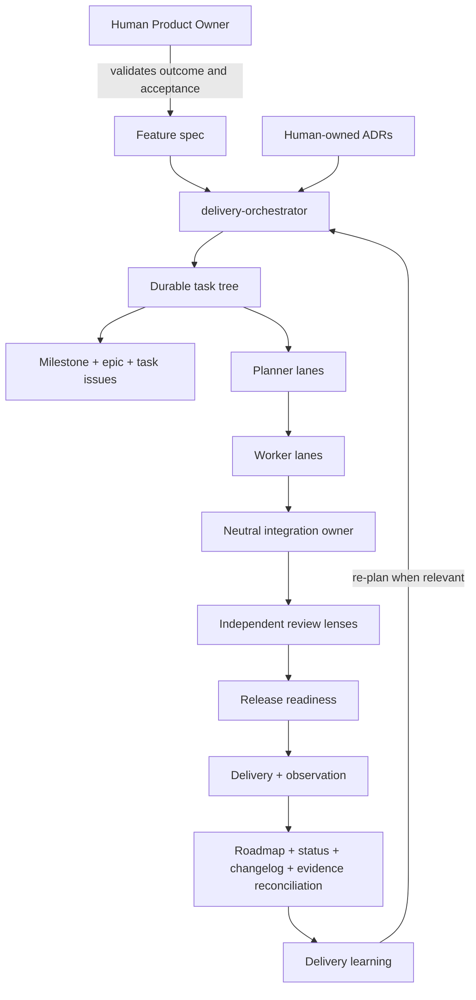

# HLD — Delivery Planning Control Plane

## Status

Approved for implementation — DPS-001 and ADR-001 accepted 2026-07-21. Delivery may
proceed in independently reviewed slices; this status does not claim all DPS-001
acceptance criteria are complete.

## Components

## Workflow definition

The system needs one installed workflow definition; per-skill definitions alone are not
enough. `docs/operating-model/DELIVERY-WORKFLOW.md` will map the operating manual's
universal lifecycle to the target project's:

- Product Owner and SME validation points;
- planner, worker, integration, review, and operator roles;
- work system and source-of-truth mapping;
- risk-proportionate planning depth;
- transition guards and re-planning triggers;
- cost, concurrency, retry, and escalation ceilings;
- reconciliation commands and documentation triggers.

The operating manual remains normative, the project profile supplies grounded facts, and
the workflow supplies the project lifecycle. Skills are stage implementations invoked by
the workflow; they do not become separate constitutions.

## Template packaging

The bootstrap asset set will include minimal templates for:

- `docs/VISION.md`;
- `docs/operating-model/DELIVERY-WORKFLOW.md`;
- `docs/ROADMAP.md`;
- `docs/STATUS.md`;
- `CHANGELOG.md`.

The initializer will preflight the complete set. It will preserve different existing
project planning files and seed only missing ones; conflicting operating contracts or
surface adapters still block all writes. The vision seeds product focus; roadmap and
status contain structure without claimed delivery state. Existing project artifacts
remain authoritative and must be mapped deliberately in the operating profile.

## Hook strategy

Hooks are an orientation and fail-fast layer, not the lifecycle authority.

### Recommended

- Extend session-start/post-compaction orientation to direct the agent to the installed
  workflow, profile, current status, roadmap, and applicable checkpoint.
- Add a lightweight validation entry point before PR/merge through CI or an explicitly
  installed Git hook.
- Report missing, stale, or contradictory planning state with the skill or human role that
  owns resolution.

### Prohibited

- Auto-accepting Product Owner or SME decisions.
- Silently editing roadmap, status, changelog, checkpoints, or issue state.
- Creating GitHub milestones/issues or other external effects without explicit authority.
- Making the cross-harness contract depend on a hook available in only one assistant.

Deterministic validators provide enforcement. Hooks improve timing and discoverability;
skills provide procedures; humans provide authority.

## Responsibility boundaries

| Component | Owns | Must not own |
| --- | --- | --- |
| Product Owner | outcome, priority, scope, acceptance | implementation or technical self-approval by default |
| Delivery orchestrator | plan tree, dependencies, ownership, budgets, reconciliation | product acceptance or domain authority |
| Planner lane | one bounded planning subtree or cross-cutting decision | delegated leaf implementation |
| Worker lane | one atomic task and its evidence | sibling scope or cross-cutting design changes |
| Integration owner | pinned assembly, merge order, convergence | Product Owner or independent-review authority |
| Reviewer | refutation through a declared lens | silent scope changes or conditional PASS |
| Sitrep | derived current state | invented progress or priority |

## Artifact model

| Artifact | Stable identifier | Authority |
| --- | --- | --- |
| Vision | document path | Product Owner |
| Feature spec | `DPS-NNN` or project equivalent | Product Owner |
| ADR | `ADR-NNN` | Architecture SME |
| Roadmap item | stable outcome ID | Product Owner |
| Milestone | tracker ID + URL | Product Owner / delivery lead |
| Epic | issue ID + spec link | Product Owner |
| Task | issue ID + parent epic | Delivery orchestrator / assigned owner |
| Candidate evidence | commit/tree SHA | Integration owner + reviewers |
| Status | dated snapshot | Delivery lead, derived by `sitrep` |
| Changelog | released version/date | Release owner |

## Core flows

### Intake and planning

1. Product Owner or agent drafts a feature spec.
2. Product Owner records acceptance or amendments.
3. Architecture SMEs accept required ADRs.
4. Delivery orchestrator creates the task tree, budgets, ownership, and context boundaries.
5. The work-system adapter creates or links the milestone, epic, and tasks after explicit
   authority for external writes.
6. Offline validation checks document schemas and local links.

### Execution and convergence

1. Planners refine only assigned planning branches.
2. Workers receive bounded task contracts and return evidence.
3. New evidence that changes intent, acceptance, or design pauses dependent tasks.
4. One integration owner assembles pinned candidates.
5. Decorrelated reviewers inspect the exact candidate.
6. Release readiness checks quality, rollback, observation, and spend.

### Reconciliation and learning

1. `sitrep` derives done, blocked, next, risks, and plan changes from the tracker and
   repository artifacts.
2. Roadmap outcomes and milestone state are reconciled.
3. `CHANGELOG.md` changes only when material behaviour ships.
4. Surprising findings are retained when they can shorten a later trajectory.

## Failure modes and controls

| Failure mode | Control |
| --- | --- |
| Split-brain planning | one decision owner; task-tree overlap check; ADR links |
| Worker context drift | bounded task contract; no implicit sibling context |
| Document/tracker drift | explicit field ownership; reconciliation command; dated status |
| Product Owner bottleneck | proportional R0/R1 path; acceptance SLA/escalation in project profile |
| Agent-spend runaway | role budgets, retry ceiling, concurrency cap, cost-per-outcome review |
| Review monoculture | at least two decorrelated lenses for consequential work |
| Merge conflict churn | isolated lanes; neutral integration owner; no worker self-merge conflict policy |
| Planning theatre | measurable acceptance; rework/conflict/supersession metrics; derived status |

## Validation design

The planned `scripts/validate_planning.py` will use only the Python standard library and
support two modes:

- default offline mode: required files, IDs, lifecycle status, local links, and issue-
  template fields;
- optional `--github`: live milestone/epic/task reconciliation through `gh`, with clear
  authentication and network failures that do not masquerade as local validation errors.

The offline mode will be added to `make check`. GitHub reconciliation will remain an
operator-invoked or separately configured CI control.
