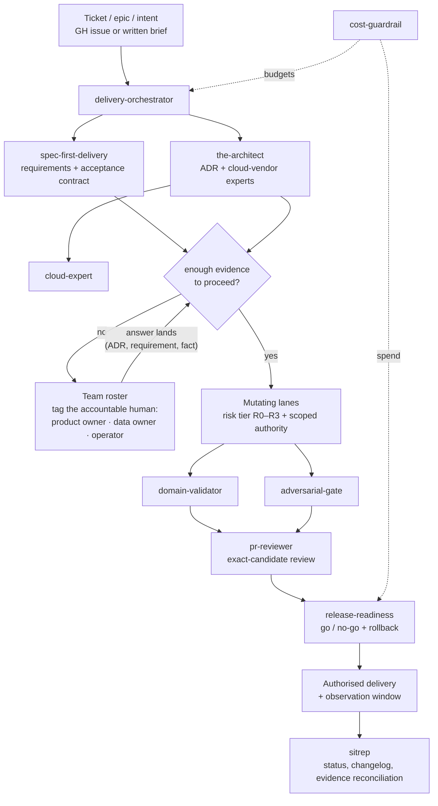

# Team Workflow — Skills, Dependencies, and the Accountability Chain

How the harness simulates a team's ways of working: intake to delivery, with the human
escalation loops that make accountability explicit. The diagram is the dependency map;
the sections below are the traceability and ownership model.

## The traceability chain

Every deliverable answers five questions, in order, each with a named home:

| # | Question | Artefact | Home |
|---|---|---|---|
| 1 | What are we building and why? | Requirement / epic | GH issue (or brief) — ticket system of record |
| 2 | What does "correct" mean? | Acceptance contract | spec in repo (`spec-first-delivery`) |
| 3 | What did we decide? | ADR | `architecture/decisions/ADR-NNN-*.md` in repo (`the-architect`) |
| 4 | Who did what, and was it checked? | Checkpoint + evidence manifest | `docs/operating-model/` (exact-candidate bound) |
| 5 | Where is it now? | Status | `sitrep` output + changelog |

A requirement is not "matched" to an ADR by convention — the spec *references* the
ADRs it depends on, and the orchestrator will not route implementation while a
dependency ADR is unresolved. Broken reference = stop, not improvisation.

## The accountability model

Skills supply capability; **named humans supply authority**. The profile's team
roster records who owns what — product owner for requirements, data owner for data
classification and the ADRs that touch their data, integration owner for candidate
assembly, operator for R3 approvals.

The escalation rule is the value-delivery chain's spine:

- **Insufficient evidence is a stop, not a prompt to improvise.** When a ticket,
  spec, or ADR lacks the information a gate needs, the lane halts, the open question
  is recorded with an owner and a resolving trigger, and the roster role is tagged.
- **Silence never converts to permission.** An unanswered escalation blocks the lane;
  it does not lower the bar.
- **Delivery status is derived, not declared.** `sitrep` reads the artefacts above;
  it does not invent progress.

## Where decisions live (and MCP knowledge seams)

ADRs default to the repo — `architecture/decisions/` — so review, drift, and evidence
tooling applies uniformly. When the enterprise estate holds decisions or sources in
SharePoint, Confluence, or Google Drive, reach them through a **governed MCP seam**
(one server, one source, read-only, least-privilege — the `.agents/mcp_config.json`
pattern), never raw credentials, and mirror the decision of record into the repo ADR.
The repo stays the canonical decision log; external systems are sources, not truth.

## Parallelism is earned by planning, not assumed

Fanning out subagents is the multiplier, but it is a *reward for a finished plan*, not a
default. The gate is precise: **a task may be picked up in parallel once — and only once — it
is an independently-shippable ticket with a written acceptance contract, a Definition of Done,
and the end-to-end user journey it serves.** Until the milestone is decomposed to that
standard, parallelism manufactures divergence faster than one agent could — merge conflicts,
duplicated work, and contradictory decisions that no reviewer asked for.

So the sequence is fixed, and the orchestrator holds it:

1. **Plan the milestone whole first** — `spec-first-delivery` writes the acceptance contracts,
   `the-architect` lands the ADRs, and the work is decomposed into epics → tickets in the issue
   tracker with the roadmap updated. This is the barrier. Nothing mutating starts before it.
2. **Then fan out** — one subagent per independently-shippable ticket, **each in its own git
   worktree** when the writes could collide (isolate on the *same* files; plain subagents are
   fine for read-only fan-out or disjoint file areas). Each carries its ticket's DoD and journey
   as its self-contained brief, so agents don't need to coordinate mid-flight.
3. **Converge through the gates** — `domain-validator` / `adversarial-gate` → `pr-reviewer`
   (exact-candidate) → `release-readiness`. The convergence gate (tests/lint/typecheck) and the
   review gate stay singular even when the build was parallel.

The rule that makes this safe: **a ticket a subagent can pick up blind is a ticket that was
planned well enough to parallelise.** If a task still needs a conversation to scope, it is not
ready to fan out — it is ready to plan. Quality comes from the plan being complete *before* the
fan-out, not from the fan-out being wide.

## The independent-reasoner gate runs at scope and at audit, not only at review

An independent reasoner — a genuinely separate model (a cross-model council: e.g. a non-primary
frontier model at high effort), invoked in a separate run — is most valuable at the two ends of
the lane, not just in the middle:

- **At scope**, before decomposition: challenge the plan's shape, surface the missing lens, and
  falsify the premise while it is still cheap to change. A plan that has survived an adversarial
  read is what earns the parallel fan-out above.
- **At audit**, before close: verify the delivered work is coherent, consistent and correct
  against its own acceptance contract — the writer never self-approves, and neither does the
  orchestrator that dispatched the build (model diversity is not independence; only independence
  is being claimed when a diff is marked reviewed).

Disagreement is the signal — dig where the independent reasoner and the primary diverge.
Agreement is not proof; shared blind spots exist, so load-bearing claims are still re-derived
from source. The council is an input; the accountable human's ruling overrides.
