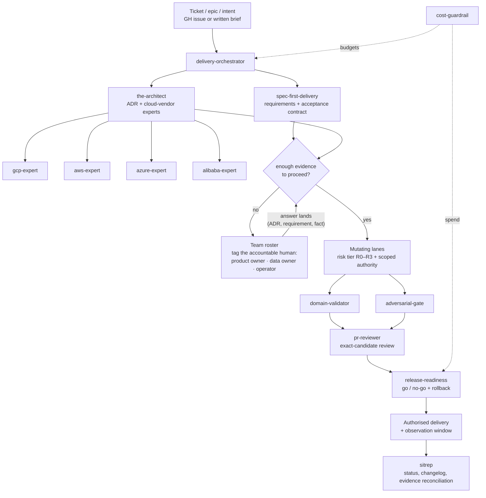

# Team Workflow — Skills, Dependencies, and the Accountability Chain

How the harness simulates a team's ways of working: intake to delivery, with the human
escalation loops that make accountability explicit. The diagram is the dependency map;
the sections below are the traceability and ownership model.

## The traceability chain

Every deliverable answers five questions, in order, each with a named home:

| # | Question | Artefact | Home |
|---|---|---|---|
| 1 | What are we building and why? | Requirement / epic | GH issue (or brief) — ticket system of record |
| 2 | What does "correct" mean? | Acceptance contract | spec in repo (`spec-first-delivery`) |
| 3 | What did we decide? | ADR | `architecture/decisions/ADR-NNN-*.md` in repo (`the-architect`) |
| 4 | Who did what, and was it checked? | Checkpoint + evidence manifest | `docs/operating-model/` (exact-candidate bound) |
| 5 | Where is it now? | Status | `sitrep` output + changelog |

A requirement is not "matched" to an ADR by convention — the spec *references* the
ADRs it depends on, and the orchestrator will not route implementation while a
dependency ADR is unresolved. Broken reference = stop, not improvisation.

## The accountability model

Skills supply capability; **named humans supply authority**. The profile's team
roster records who owns what — product owner for requirements, data owner for data
classification and the ADRs that touch their data, integration owner for candidate
assembly, operator for R3 approvals.

The escalation rule is the value-delivery chain's spine:

- **Insufficient evidence is a stop, not a prompt to improvise.** When a ticket,
  spec, or ADR lacks the information a gate needs, the lane halts, the open question
  is recorded with an owner and a resolving trigger, and the roster role is tagged.
- **Silence never converts to permission.** An unanswered escalation blocks the lane;
  it does not lower the bar.
- **Delivery status is derived, not declared.** `sitrep` reads the artefacts above;
  it does not invent progress.

## Where decisions live (and MCP knowledge seams)

ADRs default to the repo — `architecture/decisions/` — so review, drift, and evidence
tooling applies uniformly. When the enterprise estate holds decisions or sources in
SharePoint, Confluence, or Google Drive, reach them through a **governed MCP seam**
(one server, one source, read-only, least-privilege — the `.agents/mcp_config.json`
pattern), never raw credentials, and mirror the decision of record into the repo ADR.
The repo stays the canonical decision log; external systems are sources, not truth.
